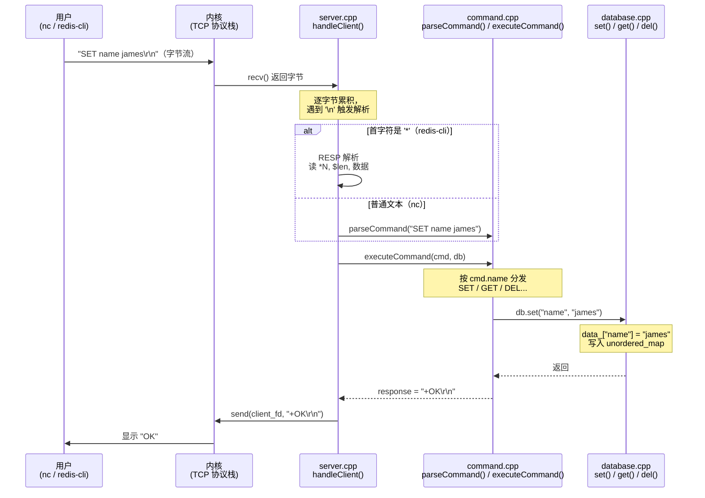

# Mini Redis 新手学习指南

## 这个项目是什么

这是一个用 C++ 从零实现的极简 Redis 服务器，目标不是性能，而是**让你看懂一个真实网络服务是如何工作的**。

你可以用它学习：
- TCP socket 的完整生命周期（socket → bind → listen → accept → recv/send → close）
- 收到的原始字节流如何一步步变成业务命令
- 数据在内存里的实际存储形式
- 用 LLDB 在任意位置"冻结"程序，观察内存状态

---

## 文件职责一览

```
main.cpp        程序入口，只做一件事：创建 Server 并启动
server.cpp/.h   网络层：监听端口、接受连接、读写字节
command.cpp/.h  协议层：把字节流解析成命令，再执行命令
database.cpp/.h 数据层：用 unordered_map 存储所有 key-value
```

每一层只关心自己的事，**不跨层直接操作**。这就是为什么代码读起来比较清晰。

---

## 建议学习顺序

```
第一步  database.h / database.cpp   最简单，只是 map 的增删改查
第二步  command.h / command.cpp     看命令怎么解析、怎么调 database
第三步  server.h / server.cpp       看 socket 怎么建立，字节怎么读
第四步  main.cpp                    把以上三层串起来，一眼就懂
```

不要从 main.cpp 开始读，它太抽象。从最底层的数据结构开始，再向上看网络部分。

---

## 完整调用链条

一条 `SET name james` 命令从敲下回车到收到 `+OK`，经历了以下步骤：

```
1. 用户在 nc / redis-cli 按下回车
       ↓
2. 操作系统将字节打包成 TCP 数据包发出
       ↓
3. 服务器内核收包，放入 client_fd 对应的接收缓冲区
       ↓
4. server.cpp: handleClient() 调用 recv() 逐字节读取
       ↓
5. 读到 '\n' → 一行命令收集完毕
       ↓
6. 判断协议类型：
       首字符 '*' → RESP 格式（redis-cli 使用）
       其他字符   → 纯文本格式（nc / telnet 使用）
       ↓
7. command.cpp: parseCommand() 按空格分词
       → Command { name="SET", args=["name","james"] }
       ↓
8. command.cpp: executeCommand() 按命令名分发
       → 调用 db.set("name", "james")
       ↓
9. database.cpp: set() 执行 data_["name"] = "james"
       → unordered_map 完成哈希写入
       ↓
10. executeCommand() 返回响应字符串 "+OK\r\n"
       ↓
11. server.cpp: send(client_fd, "+OK\r\n", ...)
       → 字节从内核缓冲区发回给客户端
       ↓
12. nc / redis-cli 收到并打印 "OK"
```

---

## 调用流程图



---

## 关键内存结构

程序运行时，堆上的数据长这样：

```
Server 对象（栈上）
└── db_（Database，内嵌在 Server 内）
    └── data_（unordered_map，桶数组在堆上）
        ├── 哈希桶 0: "age"  → "25"
        ├── 哈希桶 3: "name" → "james"
        └── 哈希桶 7: "city" → "beijing"

每个 std::string 内部：
┌──────────────┬───────────┬──────────────────────┐
│ size = 5     │ capacity  │ ptr ──────────────────┼──→ 堆: "james\0"
└──────────────┴───────────┴──────────────────────┘
```

`unordered_map` 不保证顺序，所以 `KEYS` 每次返回的顺序可能不同，这是正常的。

---

## 两种协议对比

| | nc / telnet | redis-cli |
|---|---|---|
| 发送格式 | `SET name james\n` | `*3\r\n$3\r\nSET\r\n$4\r\nname\r\n$5\r\njames\r\n` |
| 首字符 | 字母 | `*` |
| 解析路径 | parseCommand() 直接分词 | 先读参数个数，再逐段读 |
| 响应格式 | 相同（都是 RESP） | 相同（都是 RESP） |

两种格式的**响应完全相同**，区别只在输入的解析方式。

---

## 推荐的 LLDB 学习路径

按这个顺序打断点，跟着程序走一遍，比光读代码有效十倍：

```bash
lldb ./mini_redis

# 第一步：观察 TCP 连接建立
(lldb) b server.cpp:101       # accept() 返回处
(lldb) run
# → 另开终端 nc 127.0.0.1 6379
# → p client_fd               查看 fd 编号
# → p client_addr             查看客户端 IP/端口

# 第二步：观察字节接收
(lldb) b server.cpp:handleClient
(lldb) c
# → nc 里输入 SET name james 回车
# → p first_line              查看收到的完整行

# 第三步：观察命令解析
(lldb) b command.cpp:parseCommand
(lldb) c
# → finish
# → p cmd.name                查看命令名 "SET"
# → p cmd.args                查看参数 ["name","james"]

# 第四步：观察数据写入
(lldb) b database.cpp:set
(lldb) c
# → p key                     "name"
# → p value                   "james"
# → p data_                   查看整个 map（写入前后对比）

# 第五步：观察响应发出
(lldb) b server.cpp:send
(lldb) c
# → p response                "+OK\r\n"
```

---

## 运行方式

```bash
# 编译
make

# 启动服务器
./mini_redis

# 连接方式一：nc（明文协议）
nc 127.0.0.1 6379

# 连接方式二：官方 redis-cli（RESP 协议）
redis-cli -p 6379
```

支持的命令：

```
SET key value   存入键值
GET key         查询键值
DEL key         删除键
EXISTS key      检查键是否存在
KEYS            列出所有键
PING            测试连通性
```
